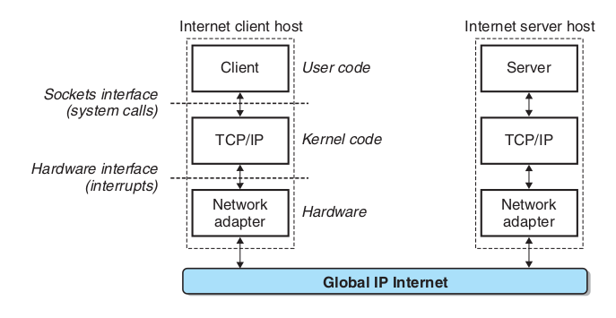

##Chapter 11 Network Programming

###11.1 The Client-Server Programming Model
Every network application is based on the client-server model. With this model, an application consists of a server process and one or more client processes. A server manages some resource, and it provides some service for its clients by manipulating that resource. For example, a Web server manages a set of disk files that it retrieves and executes on behalf of clients. An FTP server manages a set of disk files that it stores and retrieves for clients.

### 11.2 Networks
Data received from the network is copied from the adapter across the I/O and memory buses into memory, typically by a DMA transfer. Similarly, data can also be copied from memory to the network.

The crucial property of an internet is that it can consist of different LANs and WANs with radically different and incompatible technologies. Each host is physically connected to every other host, but how is it possible for some source host to send data bits to another destination host across all of these incompatible networks?
The solution is a layer of protocol software running on each host and router that smoothes out the differences between the different networks. This software implements a protocol that governs how hosts and routers cooperate in order to transfer data. The protocol must provide two basic capabilities:

- Naming scheme. Different LAN technologies have different and incompatible ways of assigning addresses to hosts. The internet protocol smoothes these differences by defining a uniform format for host addresses. Each host is then assigned at least one of these internet addresses that uniquely identifies it.
- Delivery mechanism. Different networking technologies have different and incompatible ways of encoding bits on wires and of packaging these bits into frames. The internet protocol smoothes these differences by defining a uniform way to bundle up data bits into discrete chunks called packets. A packet consists of a header, which contains the packet size and addresses of the source and destination hosts, and a payload, which contains data bits sent from the source host.

### 11.3 Global IP Internet

 
From a programmer’s perspective, we can think of the Internet as a worldwide collection of hosts with the following properties:

- The set of hosts is mapped to a set of 32-bit IP addresses.
- The set of IP addresses is mapped to a set of identifiers called Internet domain names.
- A process on one Internet host can communicate with a process on any other Internet host over a connection.

#### 11.3.1 IP Address
Because Internet hosts can have different host byte orders, TCP/IP defines a uniform network byte order (big-endian byte order) for any integer data item, such as an IP address, that is carried across the network in a packet header.

##More: tcp-ip-illustrated-volume-1.pdf
